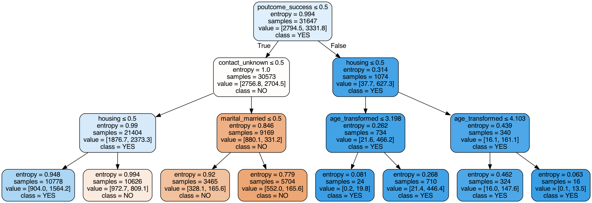

# Term_Deposit_Sale

 ----------------------------------
# Finance Marketing Modeling
 ----------------------------------

###### This work presents predictive modeling of term deposit sale for marketing purposes, to identify potential customers with a high interest in the product. The historical data is provided by the UCI Machine Learning Repository (https://archive.ics.uci.edu/ml/datasets/Bank+Marketing), donated by Portuguese banking institution marketing campaigns, and based on phone calls.

###### Several predictive algorithms were used, such as Logistic Regression, Decision Tree, Random Forest, Bagging and Boosting in order to identify a minority class of ‘yes’-customers. The final algorithm choice was based on a good balance between model recall (sensitivity) and precision scores. 

Example of the resulting Decision Tree structure is shown below:

 
